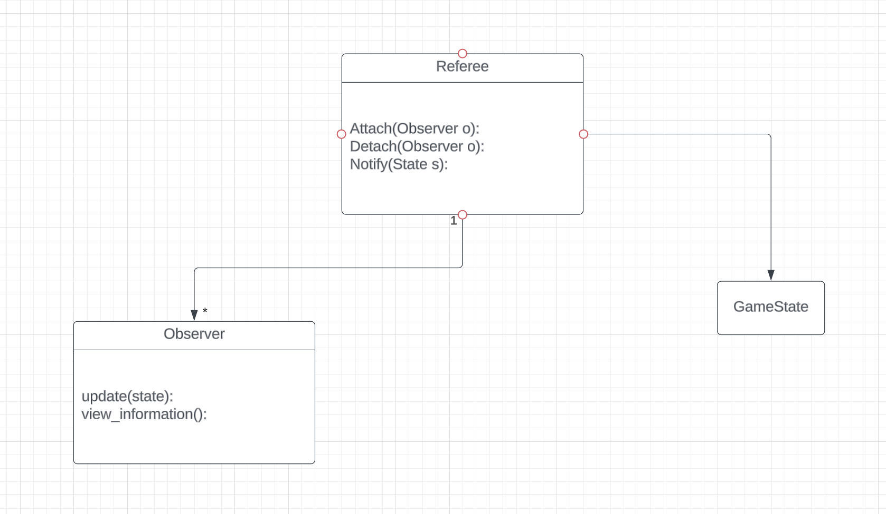

TO: Professor Felleisen\
FROM: Ethan Feldman, Jacob Schissel \
Subject: 6 – The Design

We will have a separated data definition for the observer state consisting of all necessary game information that the observer should have access to. 

## Observer Interface:

update(self, State): \
// updates the observer with the most current state information.

Image view_information():\
// create a visual representation of the most up-to-date state information received from the referee.

## As part of the referee: 

attach(Observer o):\
// Attaches an observer to this object. It will now be notified of updates to the state.

detach(Observer o):\
// Detaches an observer from this object. It no longer receives updates of the state.

notify(state):\
// Notifies all observers that are attached to the referee of changes to the state. 

