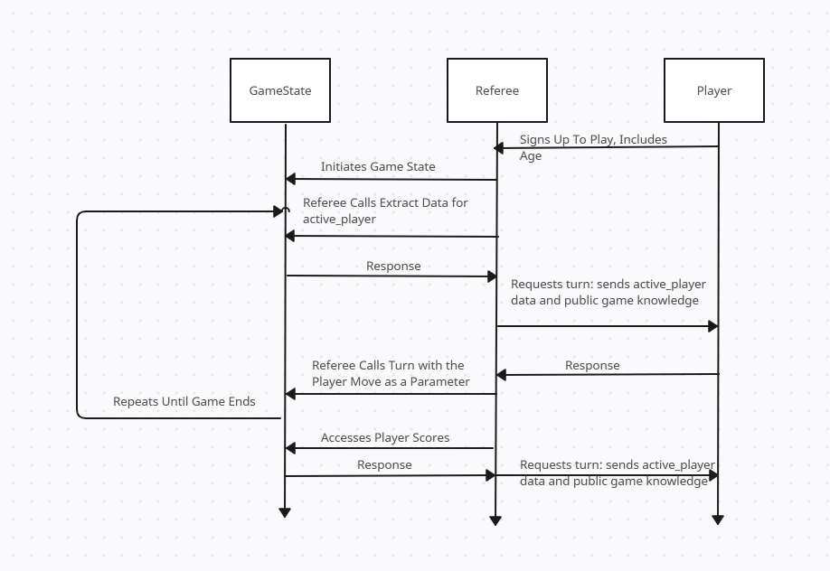

TO: Professor Felleisen

FROM: Ethan Feldman, Jacob Schissel

Subject: 5 – The Strategies: Design Task 

## Referee Interface:

initialize_player(): creates a PlayerInfo object out of data gathered from player registration and adds it to the list of players currently playing the game.

initialize_gamestate(): creates a new GameState object using the list of players who have signed up alongside the initial tile

get_data_for_active_player(): retrieves PlayerInfo of the active player from the GameState (this includes are public player knowledge as well)

send_data_to_active_player(): sends PlayerInfo data about active player and public player knowledge to the active player.

is_player_move_legal(): checks whether the proposed move is legal, if so it will call make_player_move(), otherwise it will remove the player from the game

make_player_move(): executes player’s requested move in game_state. This is dominated by a is_player_move_legal check to ensure a move can be made.

get_player_scores(): retrieves the scores of every player currently in the game.

send_results(): sends a boolean to each player, if true that player has won, otherwise the player has lost

## Referee-State Protocol

